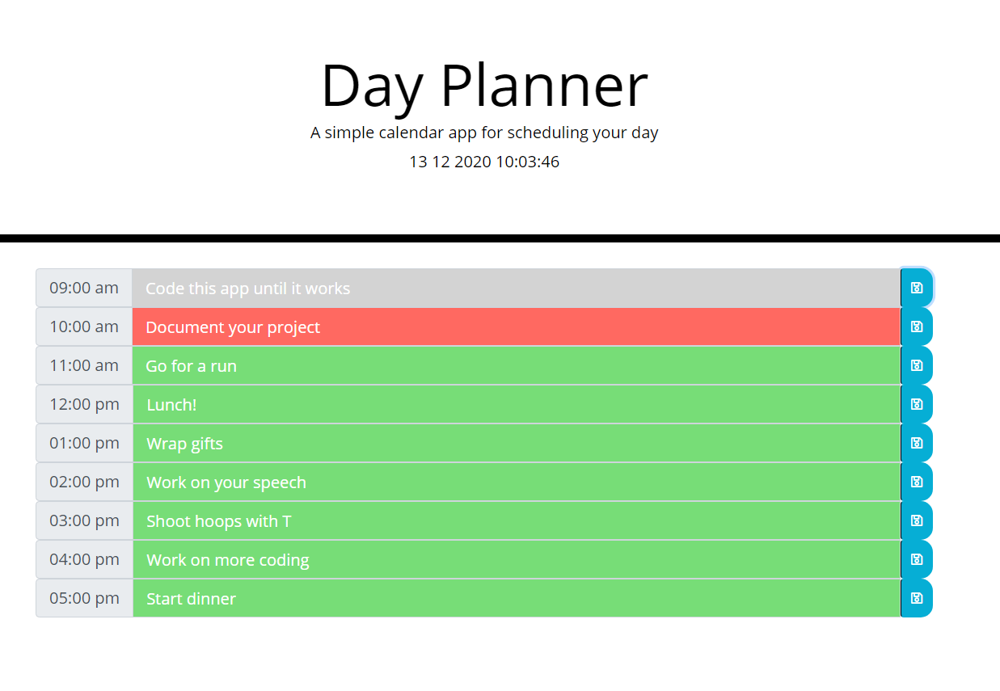

# Work Day Scheduler

This is a daily planner to help you plan your day. After adding items to the planner the items will persist.

## Description

The application is a web app that allows you to track your day by saving tasks in specific hourly intervals. When you save the task, your local storage will hold the key and value to be reused when you reload or revisit the page. 

This app helped me understand the value of jQuery. jQuery is a JavaScript library designed to simplify HTML DOM tree traversal and manipulation, as well as event handling, CSS animation, and Ajax. 

## Link to Site

https://codragon2020.github.io/workday_scheduler/

This site was made with:

## Screenshots

